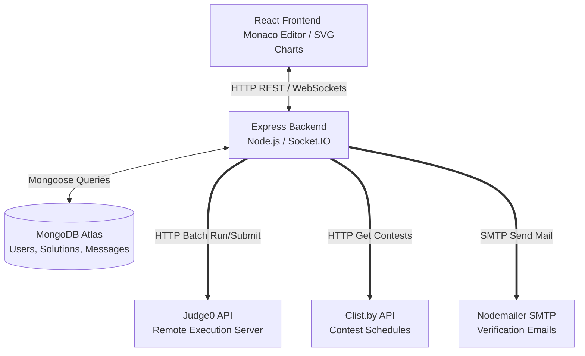

# ZCoder 🚀

[](https://nodejs.org/)
[](https://react.dev/)
[](https://expressjs.com/)
[](https://www.mongodb.com/)
[](https://socket.io/)
[](https://judge0.com/)
[](#license)

ZCoder is a high-fidelity, interactive competitive programming and social dashboard. It enables developers to solve algorithm challenges in a feature-rich workspace, run and compile code in real-time, monitor solving statistics, analyze growth trends, and converse with peers in real-time chat rooms.

---

## 📑 Table of Contents
1. [Overview](#-overview)
2. [Key Features](#-key-features)
3. [Tech Stack](#-tech-stack)
4. [Architecture Overview](#-architecture-overview)
5. [Folder Structure](#-folder-structure)
6. [API Specification](#-api-specification)
7. [Security & Verification](#-security--verification)
8. [Installation & Setup](#-installation--setup)
9. [Environment Variables](#-environment-variables)
10. [Usage Guide](#-usage-guide)
11. [Screenshots](#-screenshots)
12. [Future Enhancements](#-future-enhancements)
13. [Contributing](#-contributing)
14. [License](#-license)
15. [Author](#-author)

---

## 🔍 Overview

ZCoder serves as a comprehensive practice hub for software engineering interviews and competitive programming. Users can tackle coding problems across multiple languages with immediate validation against unit tests. Additionally, the platform integrates social features like group/peer chats and contest tracking to promote community-driven learning.

---
## 💡 Why ZCoder?

ZCoder is a full-stack coding platform inspired by LeetCode and Codeforces. It combines competitive programming, real-time code execution, analytics, contests, bookmarking, and developer collaboration into a single application.


## ✨ Key Features

- **Interactive Coding Workspace**: 
  - Integrated with **Monaco Editor** (`@monaco-editor/react`) for full autocomplete, syntax highlighting, and formatting.
  - Custom workspace controls: toggle theme (`vs-dark` / `vs-light`), adjust font size, and expand to fullscreen mode.
  - Left panel shows problem description, sample/hidden test cases, constraints, hints, and local submissions history.
- **Real-Time Code Execution**: 
  - Integrated with the **Judge0 API** to execute batch code inputs in **C, C++, Java, Python, and JavaScript**.
  - Provides execution metrics (runtime speed in `ms`, memory consumed in `MB`) and detailed standard output/compiler logs.
- **Analytics & Streak Heatmap**:
  - A GitHub-style contribution calendar (`ActivityHeatmap`) tracks consecutive solving days.
  - Custom SVG charts (`SvgCharts`) illustrate user statistics: solved difficulty distribution (Doughnut), weekly progression (Line), and language usage breakdown (Bar).
- **Socket.IO Chat Integration**:
  - Live peer-to-peer and group rooms (e.g., *Code Warriors*, *DSA Study Group*).
  - Live typing indicator alerts, real-time message streams, online status indicators, and self-message deletion support.
- **Contest Dashboard**:
  - Integrates with the **Clist.by API** to show upcoming and recently completed competitive coding contests.
  - Features an interactive calendar interface where dates with scheduled contests are marked with custom indicators.
- **Notification & Achievement System**:
  - Pop-up notifications alert users to accepted/failed submissions.
  - Automated achievement triggers for milestone solving (e.g., First Solve, 10/50/100 Solves) and maintaining streaks (3-day, 7-day milestones).
- **Bookmarks & Comments**:
  - Bookmark solutions for specific challenges for quick access later.
  - Threaded comment systems for public solutions, allowing peer-to-peer review and code review comments.

---

## 🛠️ Tech Stack

### Frontend
- **Framework**: React (v18.2.0)
- **Tooling**: Vite (v5.2.12)
- **Editor**: Microsoft Monaco Editor (`@monaco-editor/react`)
- **Routing**: React Router DOM (v6.23.1)
- **Charts/Visuals**: Custom SVG Charts, GitHub-style Heatmap, React Calendar
- **Real-time**: Socket.IO Client (v4.8.1)
- **Icons**: React Icons (Fi, Fa, Io)
- **Styling**: Pure CSS (using custom Theme Variables for Light/Dark mode transitions)
- **HTTP Client**: Axios (v1.18.1) & Native Fetch

### Backend
- **Framework**: Express.js (v4.19.2) on Node.js
- **Database**: MongoDB & Mongoose ODM (v8.4.0)
- **Real-time Server**: Socket.IO (v4.8.1)
- **Mailing**: Nodemailer (v6.9.13) for user verification
- **Process Manager**: Nodemon (v3.1.1) in development

### External Integrations
- **Code Execution**: Judge0 API
- **Contests Data**: Clist.by API

---

## 🏗️ Architecture Overview

The ZCoder system is designed as a decoupled client-server architecture:



1. **Client Tier**: A React application utilizing Context API for auth sessions, Monaco editor for code capture, and HTML5 Canvas/SVG elements for rich dashboard animations.
2. **Server Tier**: Express handles HTTP requests, while Socket.IO handles WebSocket rooms for low-latency chat sessions.
3. **Database Tier**: Persistent collections for users, question catalogs, bookmarks, comments, past solutions, and offline messages.
4. **Execution Sandbox**: Submits user code to Judge0 compilers, polling asynchronously until batch test results are completed.

---

## 📁 Folder Structure

```
ZCoder/
├── Backend/                    # Express.js Server
│   ├── api/                    # Authentication (user.js) & Messages (messages.js) routes
│   ├── config/                 # DB configuration (db.js)
│   ├── controllers/            # Core business logic handlers (solutions, bookmarks, contests)
│   ├── model/                  # Mongoose MongoDB Schemas
│   ├── routes/                 # Express route mappings
│   ├── scripts/                # Utility scripts to populate questions dataset
│   ├── views/                  # Static success/failure HTML email templates
│   ├── server.js               # Entry point (Express + Socket.IO Server configuration)
│   ├── questions.json          # Dataset of questions
│   ├── package.json            # Backend dependencies
│   └── .env                    # Secret environment variables (ignored in Git)
├── public/                     # Static frontend files
├── src/                        # React Frontend Source
│   ├── assets/                 # Custom styling configurations and visual resources
│   ├── components/             # Reusable UI components
│   │   ├── Analytics/          # Contribution heatmaps & SVG Charts
│   │   ├── Chat/               # Peer-to-peer/Group chat items
│   │   ├── Nav/                # Navbar containing notifications drop-downs
│   │   ├── Footer/             # Footer links
│   │   └── Toggle/             # Theme switcher (Light/Dark mode)
│   ├── hooks/                  # Custom React hooks (useAuthContext, useQuestionsApi, useNotifications)
│   ├── pages/                  # Route container pages
│   │   ├── Home/               # Dashboard containing calendar and CLIST contests
│   │   ├── PracticePage/       # Code editor, custom test cases, and problem lists
│   │   ├── ProfilePage/        # Friend lists, cf handles, and analytics diagrams
│   │   ├── ChatPage.jsx        # Conversational message center
│   │   └── SubmissionsPage/    # Historical code lists & details
│   ├── App.jsx                 # Client-side router configuration
│   ├── AuthContext.jsx         # Client-side session provider
│   └── main.jsx                # SPA bootstrapping
├── index.html                  # Main SPA HTML structure
├── vite.config.js              # Vite compiler configuration
├── LICENSE                     # Project viewing license
├── package.json                # Project root and frontend dependencies
└── API_HANDLING_GUIDE.md       # API retry, caching, and deduplication guide
```

---

## 🔌 API Specification

All paths are relative to the backend base URL (default: `http://localhost:8008`).

### User Accounts & Profile
| Endpoint | Method | Description |
| :--- | :---: | :--- |
| `/user/signup` | POST | Register a new user (triggers verification email). |
| `/user/signin` | POST | Authenticate user credentials. |
| `/user/verify/:userId/:uniqueString` | GET | Verify account through email verification link. |
| `/user/resend-verification` | POST | Resend verification email for an unverified account. |
| `/user/:id` | GET | Retrieve user profile metadata. |
| `/user/:id/techstacks` | PUT | Update user tech stacks. |
| `/user/:id/languages` | PUT | Update user coding languages. |
| `/user/:id/friends` | PUT | Update friends list. |
| `/user/:id/add-friend` | PUT | Add a new user as a friend. |
| `/user/:id/handles` | GET | Retrieve user's Codeforces handles. |
| `/user/:id/handles` | POST | Add a Codeforces handle to user profile. |
| `/user/:id/handles/:handle` | DELETE | Remove a Codeforces handle from profile. |
| `/search` | GET | Search for a registered user by username. |

### Questions Catalog
| Endpoint | Method | Description |
| :--- | :---: | :--- |
| `/api/questions` | GET | Retrieve all questions (supports pagination, filtering by difficulty/tag, and sorting). |
| `/api/questions/search` | GET | Autocomplete query to search questions (`/api/questions/search?q=query`). |
| `/api/questions/difficulty/:difficulty` | GET | Fetch questions by difficulty (`Easy`, `Medium`, `Hard`). |
| `/api/questions/tags` | GET | Retrieve list of all unique topic tags. |
| `/api/questions/:titleSlug` | GET | Fetch detailed problem statement by unique URL slug. |

### Solutions & Remote Compiler (Judge0)
| Endpoint | Method | Description |
| :--- | :---: | :--- |
| `/user/solutions/:titleSlug/run` | POST | Run code against custom or sample inputs using Judge0 CE. |
| `/user/solutions/:titleSlug/submit` | POST | Run code against all test cases, store solution metadata, and generate notifications/achievements. |
| `/user/solutions/:titleSlug` | GET | Fetch public solutions for a specific question. |
| `/user/solutions/byUser/:userId` | GET | Fetch past submissions history for a specific user. |
| `/user/solutions/detail/:solutionId` | GET | Retrieve code details, runtime stats, and test outputs for a specific submission. |
| `/user/solutions/:solutionId` | DELETE | Delete an existing solution. |

### Bookmarks & Solution Comments
| Endpoint | Method | Description |
| :--- | :---: | :--- |
| `/user/bookmarks` | POST | Add a solution to bookmarks list. |
| `/user/bookmarks/:userId` | GET | Retrieve all bookmarks for a specific user. |
| `/user/bookmarks/:userId/:titleSlug` | DELETE | Remove bookmark for a question. |
| `/user/comments/:solutionId` | POST | Post a feedback comment on a solution. |
| `/user/comments/:solutionId` | GET | Retrieve comments for a solution. |

### Competitive Contests
| Endpoint | Method | Description |
| :--- | :---: | :--- |
| `/api/contests/` | GET | Get future resource contests from Clist.by (e.g., Codeforces, LeetCode, AtCoder, etc.). |

### Real-Time Chats (Socket.IO backed)
| Endpoint | Method | Description |
| :--- | :---: | :--- |
| `/api/messages/:roomId` | GET | Retrieve past chat history for a group/p2p room. |
| `/api/messages/:messageId` | DELETE | Delete a specific message by its ID. |

---

## 🔒 Security & Verification

1. **Password Hashing**: User passwords are encrypted with `bcrypt` (using 10 salt rounds) before persistence in MongoDB.
2. **Account Verification Gateway**:
   - Accounts require activation before log in is permitted.
   - Upon signup, `nodemailer` transmits a secure verification email.
   - The link contains a cryptographically random, one-time UUID string mapped to the user inside a `Userverification` collection, expiring in 1 hour.
3. **CORS Safe-Listing**: Minimal CORS header sets are applied to external resource requests (e.g. Judge0 sandbox and Clist API queries) via `fetchExternalApi` in `src/utils/apiUtils.js` or standard cors middleware on the backend to prevent cross-origin issues.

---

## ⚙️ Installation & Setup

Ensure you have **Node.js** (v18+) and **MongoDB** installed or access to a MongoDB Atlas cluster.

### 1. Clone the Project
```bash
git clone https://github.com/Manikanta5143/ZCoder.git
cd zcoder
```

### 2. Configure Backend Environment
Create a `.env` file inside the `Backend/` directory and configure the environment variables:
```bash
cd Backend
touch .env
```
Add your configurations (see [Environment Variables](#-environment-variables) for options):
```env
AUTH_EMAIL=your-gmail@gmail.com
NODE_MAILER_PASS=your-gmail-app-password
BACKEND_URL=http://localhost:8008
FRONTEND_URL=http://localhost:5173
CLIST_USERNAME=your-clist-username
CLIST_API_KEY=your-clist-api-key
```

### 3. Install Dependencies & Launch Backend
```bash
npm install
npm start
```
*The backend server will run on `http://localhost:8008`.*

### 4. Install Dependencies & Launch Frontend
Open a new terminal window in the root directory:
```bash
npm install
npm run dev
```
*The React development server will start on `http://localhost:5173` (or proxy to `http://localhost:8008` as specified in `package.json` proxy configuration).*

---

## 🔑 Environment Variables

The backend application requires the following parameters in `Backend/.env`:

- `AUTH_EMAIL`: Gmail account username used by Nodemailer to dispatch confirmation links.
- `NODE_MAILER_PASS`: Gmail App Password (16 characters) generated under Google Account Security.
- `BACKEND_URL`: Public or local IP address of the Express backend server (default: `http://localhost:8008`).
- `FRONTEND_URL`: Local or public IP hosting the Vite React client (default: `http://localhost:5173`).
- `CLIST_USERNAME`: Your registered username on [Clist.by](https://clist.by/) to fetch contest feeds.
- `CLIST_API_KEY`: API token from Clist.by user settings dashboard to authenticate calls.
- `VERIFICATION_BASE_URL` *(Optional)*: Base URL appended to the verification email (defaults to `http://localhost:8008/` if omitted).

---

## 📖 Usage Guide

### Step 1: Registration and Activation
1. Navigate to `/signup` and fill out your email, username, and password.
2. Check your mailbox for the validation link.
3. Click the activation button. Upon success, you will be redirected to the **Verification Success** page.
4. Log in at `/login` with your credentials.

### Step 2: Practicing Coding Problems
1. Navigate to `/practice` to view the list of coding challenges. Use the search bar, filter by difficulty (Easy, Medium, Hard), or filter by tags (e.g., Array, String, Hash Table) to find a problem.
2. Select a problem to enter the coding sandbox.
3. Choose your preferred programming language from the editor header.
4. Complete the starter code in the Monaco Editor, adjust your editor settings, and click **Run** to validate against sample inputs.
5. Once confident, click **Submit** to run your code against all hidden test suites.

### Step 3: Checking standouts & Analytics
1. View your solved progress, language statistics, and contribution streak heatmap in the `/profile` section.
2. Add your competitive programming handles (e.g., Codeforces) to consolidate your external programming footprints.
3. Visit `/leaderboard` to see rankings based on total points accumulated (10 for Easy, 20 for Medium, 30 for Hard).

### Step 4: Real-time Chats
1. Go to `/chat`.
2. Browse through active user conversations or join group channels like *DSA Study Group* or *Code Warriors* to discuss algorithms.

---

## 🖼️ Screenshots

*Below are mockup placeholders of the ZCoder user interfaces. Real visual assets can be placed in these locations.*

#### 1. Code Editor and Sandbox Workspace
```
+-----------------------------------------------------------+
| ZCoder   Practice   Contests   Leaderboard   Profile      |
+-----------------------------------------------------------+
| Two Sum (Medium)        | Language: Python 3  [Theme: Dark] |
|                         |---------------------------------|
| Given an array of...    | def twoSum(nums, target):       |
|                         |     # Write code here...        |
| Examples:               |                                 |
| Input: nums = [2,7]     |                                 |
| Output: [0,1]           |---------------------------------|
|                         | Testcases   | Result            |
| Constraints:            | Input: [2,7], Target: 9         |
| 2 <= nums.length <= 104 | Run Code    | [Submit Solution] |
+-----------------------------------------------------------+
```

#### 2. Profile Dashboard and Heatmap
```
+-----------------------------------------------------------+
| Username: Manikanta                                         |
| Streak: 7 Days  [🔥]                                      |
|                                                           |
| Solved Distribution      | Contribution Calendar         |
| [Easy: 45] [Medium: 20]  | [■][■][ ][ ][■][■] Mon        |
| [Hard: 5]                | [■][ ][■][■][■][ ] Tue        |
|                          | (Green tiles represent solve  |
| Language: JavaScript     |  dates over the past year)    |
+-----------------------------------------------------------+
```

#### 3. Real-Time Chat Workspace
```
+-------------------+---------------------------------------+
| Conversations     | Room: DSA Study Group                 |
+-------------------+---------------------------------------+
| Code Warriors     | Manikanta: Check out my solution!      |
| DSA Study Group   | Praneeth: That logic looks optimized. |
| Manikanta         | Satish: Let's solve two sum next.     |
| Satish            | [ Type your message...         ] [Send]|
+-------------------+---------------------------------------+
```

---

## 🚀 Future Enhancements

1. **Mount Remaining Routes**: Formally mount the `leaderboardRoute` and `notificationRoute` directly inside `Backend/server.js` (currently present in the routes/controllers but not exposed on the Express app).
2. **WebSocket Leaderboard Pushes**: Transition the static leaderboard cache fetching to live updates using Socket.IO events.
3. **Advanced Coding Analytics**: Graph visual progress comparing runtime and memory efficiency scores relative to peer submissions.
4. **Enhanced Chat Rooms**: Support user-defined custom room creation and password-secured channels directly from the chat page interface.

---

## 👨‍💻 My Contributions

Although ZCoder was initially developed as a collaborative academic project, I was responsible for the majority of the implementation and ongoing development, including:

- Designing and developing the complete React frontend.
- Building REST APIs using Node.js and Express.js.
- MongoDB database schema design and integration.
- JWT authentication and email verification using Nodemailer.
- Judge0 API integration for real-time code execution.
- Socket.IO based one-to-one and group chat.
- User analytics dashboard, activity heatmap, and charts.
- Bookmarks, submissions, notifications, and profile modules.
- UI/UX improvements, responsive layouts, and dark/light theme.
- Project documentation and repository maintenance.

 --- 

## 🤝 Contributing

We welcome contributions to ZCoder! To contribute:

1. Fork this repository.
2. Create a feature branch: `git checkout -b feature/AmazingFeature`
3. Commit your changes: `git commit -m 'Add some AmazingFeature'`
4. Push to the branch: `git push origin feature/AmazingFeature`
5. Open a Pull Request.

---

## 📄 License

Copyright (c) 2026 Manikanta Mani.

This project is licensed under a custom viewing and modification license. Under this license:

- **Viewing Only**: The project files may be cloned and viewed locally for educational purposes, learning, and interview preparation.
- **Modification**: You may modify the project for personal learning only. Modified versions must not be redistributed or publicly shared without permission.
- **No Redistribution**: Copying, distributing, publishing, or publicly deploying the project or any modified version is prohibited without prior written permission from the author.
- **Non-Commercial**: Commercial use, resale, or incorporation of this project into commercial products is strictly prohibited without prior written permission from the author.
- **Attribution**: Any reference to this project should credit the original author.

For permission requests, please contact the project author through GitHub.

---

## ✍️ Author

- **Author:** Manikanta Mani
- **Email:** manikantamani90140@gmail.com
- **GitHub:** https://github.com/Manikanta5143
- **Project:** ZCoder